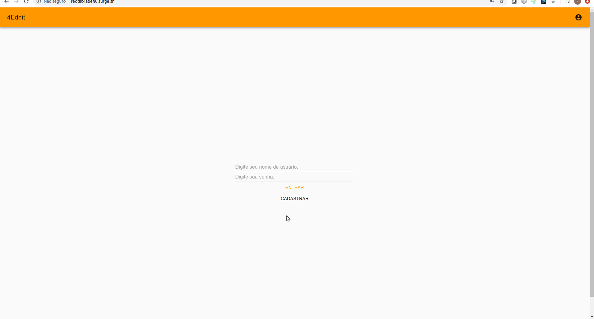
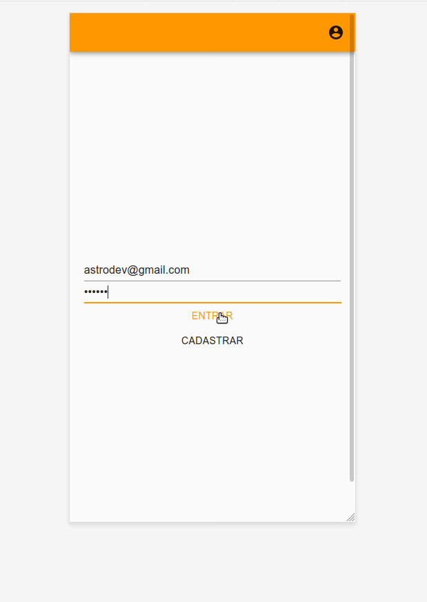

# 4eddit

## Descrição
Implementação de uma rede social funcional baseada no https://www.reddit.com/

## Links : 
1. [deploy](http://reddit-labenu.surge.sh/)
2. [documentação api ](https://documenter.getpostman.com/view/674905/SzYXXKEE?version=latest#08adf102-4d87-4f70-9dc3-b3c321b29739)


> Status do Projeto: Concluido :heavy_check_mark:

### Principais tecnologias utilizadas:

1. React
2. Styled-components
3. Redux
4. Axios
5. Redux-Thunk
6. Material-ui
7. Responsividade

### Projeto 
Essa semana, vocês irão implementar uma rede social! Já fizemos vários protótipos de redes sociais, mas nenhuma delas realmente funcional. A ideia agora é fazer uma rede real, com cadastro, login, posts, likes e comentários. Para isso, iremos nos basear no **[reddit.com](https://reddit.com).**

A rede social terá 4 páginas:

### Página de login


A página de login possui dois campos de texto: email e senha. O comportamento será o mesmo da página de login feita semana passada. Ao fazer o login, o usuário deverá ser redirecionado para a página de feed.

A página possui também um botão "Cadastrar", que leva o usuário para a página de cadastro.

### Página de cadastro


A página de cadastro possui 3 campos: nome de usuário, email e senha. O endpoint de cadastro retornará as mesmas informações do endpoint de login. Portanto, após cadastrar, o usuário deverá ser redirecionado para a página de feed, já estando logado (ou seja, com o token salvo no LocalStorage).

### Página de feed (lista de posts)


A página de feed deverá mostrar todos os posts, além de um formulário para a criação de post. O formulário possui apenas o campo de texto. Cada post mostrará o nome de usuário que postou, o texto do post, o número de votos (positivo ou negativo) e o número de comentários. Caso o usuário tenha votado positiva ou negativamente, isso deverá estar indicado. Todas essa informações serão fornecidas pela API.

Quando o usuário clicar em um post, ele deverá ser redirecionado para a página do respectivo post. 

Quando um usuário clicar em votar (positiva ou negativamente), uma requisição deverá ser feita indicando a "direção" do voto. Um voto positivo é indicado com o número `1`. Um voto negativo é indicado com o número `-1`. Para remover um voto, a direção deve ser `0`.

Essa página só pode ser acessada por um usuário logado. Caso o usuário não esteja logado, deverá ser redirecionado para a página de login.

### Página de post


A página de um post mostrará o mesmo card de post da página de feed, com o usuário, texto, curtidas e número de comentários. Abaixo, terá um formulário para criação de comentários e os cards de comentários. A estrutura é muito similar à do post, mas comentários não possuem outros comentários dentro deles. A lógica de votos é a mesma do post.

Essa página só pode ser acessada por um usuário logado. Caso o usuário não esteja logado, deverá ser redirecionado para a página de login.

## Como rodar a aplicação 


No terminal, clone o projeto:

```git clone: https://github.com/felipe0520/4eddit ```

Entre na pasta do projeto  :
```cd 4eddit ```

Instale as dependências : 
```npm install ```

Execute a aplicação:
```npm start ```

## Gif da aplicação em ambiente desktop:



## Gif da aplicação em ambiente mobile



## Coladorador

[ <br> <sub> Diana Regina </sub>](https://github.com/Diana-ops) |
| :---: |  

[ <br> <sub> Mackson Welton </sub>](https://github.com/MacksonWelton) |
| :---: | 
